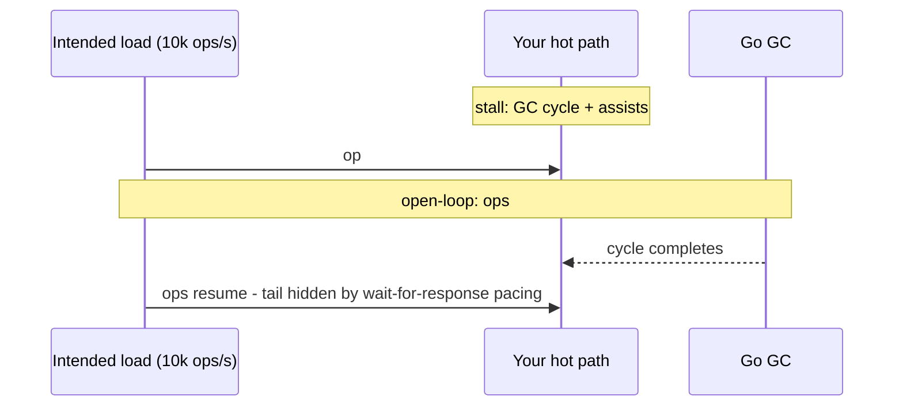

<div align="center">

# ⚡ go-hotpath

> **Answer the question every latency-sensitive Go system can't: did the GC interfere with my hot path?**

[](https://go.dev/)
[](https://pkg.go.dev/github.com/0xshikhar/go-hotpath)
[](https://github.com/0xshikhar/go-hotpath/actions/workflows/ci.yml)
[](BENCHMARK.md)
[](BENCHMARK.md)
[](LICENSE)

*A small, dependency-free Go toolkit for detecting, measuring, and controlling garbage-collector interference - zero-allocation observability windows, reversible runtime control, honest open-loop latency benchmarking, and a CI gate that makes `//hotpath:noalloc` enforceable.*

[📊 Benchmark Report](BENCHMARK.md) • [🔌 Integration Guide](INTEGRATIONS.md) • [🚀 Quick Start](#-quick-start) • [🧩 The Four Pieces](#-the-four-pieces) • [⚖️ Honest Scope](#-honest-scope)

</div>

---

## 📌 What this is

Go's GC is excellent - but a matching engine, a feed decoder, a hot-path codec, or a real-time service needs to **know** when it ran and to **prove** a function can't allocate. Today that's tribal knowledge plus closed-loop benchmarks that hide the tail.

`go-hotpath` makes the answer a first-class API across four layers:

| Layer | Package | Question it answers | Cost |
|---|---|---|---|
| **Detect** | [`guard`](./guard) | Did a GC cycle complete inside this window? | ~450 ns, **0 allocs** |
| **Measure** | [`bench`](./bench) | What does the tail look like *under open-loop load* - including GC CPU attribution? | 2.0 ns per record |
| **Control** | [`profile`](./profile) | Can I silence the GC for a window and put it back safely? | startup/boundary |
| **Prevent** | [`hotpathcheck`](./cmd/hotpathcheck) | Did a code change introduce an allocation on the annotated path? | CI gate |

```text
┌─────────────────────────────────────────────────────────────────┐
│                     THE FOUR-LAYER LOOP                         │
│                                                                 │
│   write-time:   //hotpath:noalloc + go vet -vettool             │
│                 → allocation regressions fail CI                 │
│                                                                 │
│   run-time:     guard.Assert in tests                           │
│                 → exact alloc counts (ReadMemStats ground truth) │
│                                                                 │
│   production:   g.Begin() / w.End() per batch                   │
│                 → "was this window quiet?" at ~450 ns / 0 alloc  │
│                                                                 │
│   control:      profile.SilentWindow + profile.QuietGC          │
│                 → GC on your schedule, not the pacer's           │
└─────────────────────────────────────────────────────────────────┘
```

---

## 📑 Table of Contents

1. [What this is](#-what-this-is)
2. [The evidence](#-the-evidence)
3. [Quick start](#-quick-start)
4. [The four pieces](#-the-four-pieces)
5. [Why closed-loop benchmarks lie](#-why-closed-loop-benchmarks-lie)
6. [Honest scope](#-honest-scope)
7. [Requirements & version policy](#-requirements--version-policy)
8. [Docs](#-docs)
9. [License](#-license)

---

## 🔬 The evidence

Measured on a real order-book workload (Apple M4 Pro, go1.26.0, open-loop 100k ops/s - [full methodology](BENCHMARK.md)):

> **A zero-allocation order book (Book C) ran clean in isolation - then 4 neighbor goroutines triggered 338 GC cycles and its p99 went from 0.9 µs to 16.5 µs, an 18× tail regression caused entirely by allocation it didn't do.**

| Book (alloc/op) | Neighbor | p99 | p99.9 | GC cycles | Mark-assist CPU |
|---|---|---|---|---|---|
| C (0 objs) | none | 0.9 µs | 10.8 µs | 0 | 0 |
| C (0 objs) | 4 allocating | **16.5 µs** | **62.7 µs** | **338** | **8.25 ms** |
| A (~3 objs) | none | 5.3 µs | 18.3 µs | 0 | 0 |
| A (~3 objs) | 4 allocating | **27.1 µs** | **70.3 µs** | **354** | **9.19 ms** |

Two things the columns settle that ordinary benchmarks can't:

- **The process is the interference boundary.** Book C allocates nothing, yet pays the price - and `guard`'s counters + `bench`'s run-level capture are how you see *which* mechanism (cycles, assists, pauses) did it.
- **Service time stayed ~3 µs while latency hit 62.7 µs.** The tail was lateness - a closed-loop benchmark would have printed `p99.9 ≈ 3 µs` and missed it entirely.

Reproduce: `go run ./spike -e1=false -e2=false -e3=false -e4 -e5 -dur=4s -repeats=3`

---

## 🚀 Quick start

```bash
go get github.com/0xshikhar/go-hotpath/guard
go get github.com/0xshikhar/go-hotpath/profile
go get github.com/0xshikhar/go-hotpath/bench
go install github.com/0xshikhar/go-hotpath/cmd/hotpathcheck@latest
```

**Detect - production windows:**

```go
g := guard.New()                       // once, at init - one per goroutine
w := g.Begin()                         // ~226 ns, zero allocations
processBatch(batch)
if r := w.End(); !r.Quiet() {          // a GC cycle completed inside
	log.Print(r.Explain())             // "2 automatic GC cycle(s) completed…"
}
```

**Prove - in tests:**

```go
guard.Assert(t, func() { book.Apply(&cmd, &ev) })          // exact, STW - tests only
guard.AssertWithin(t, guard.Budget{Allocs: 2, Bytes: 64}, fn)
```

**Prevent - in CI:**

```go
//hotpath:noalloc
func (e *Engine) apply(c *Command) { /* annotated helpers only */ }
```
```bash
go vet -vettool=$(which hotpathcheck) ./...   # fails on new alloc sites
```

**Control - reversible silent windows:**

```go
s, err := profile.Apply(profile.SilentWindow(512 << 20)) // GOGC=off + limit
if err != nil { log.Fatal(err) }
res := profile.QuietGC()   // collect once at a boundary of your choosing
defer s.Undo()             // restore verified prior settings
```

**Measure - honest tails:**

```go
rep := bench.New(100_000, bench.WithDuration(10*time.Second)).Run(fn)
fmt.Println(rep.String())   // dual Latency/Service series + GC attribution
```

---

## 🧩 The four pieces

### `guard` - "did the GC touch this window?"

Per-goroutine, zero-allocation observation windows built on `runtime/metrics`. `Quiet()` reports completed-cycle interference; `Explain()` names the mechanism (automatic vs forced, limiter engagement). `Exact`/`Assert`/`AssertWithin` give exact `ReadMemStats` counts in tests - the two modes exist because production can't afford stop-the-world and tests can't tolerate lower bounds.

### `bench` - open-loop latency, GC attribution included

Intended-time pacing (`start + i·interval`, no drift), sleep-then-spin pacing below 50 µs, **late ops recorded, never dropped** - and every `Report` carries GC evidence: completed cycles (forced/auto split), process-wide alloc bytes, mark-assist / dedicated / pause CPU classes, plus `/sched/latencies` and `/sched/pauses` delta-percentiles reproduced from the runtime's exact 162-bucket layout.

### `profile` - reversible runtime control

`Apply` → `Session` with **verified read-back** through `runtime/metrics` (catches stale knobs and runtime clamping). `SilentWindow(n)` = GOGC=off + a memory limit - the supported way to go quiet. `QuietGC()` makes collection an appointment. Caveat documented loudly: `GOMAXPROCS` pinning is a one-way door (disables Go 1.25+ cgroup auto-detection).

### `hotpathcheck` - the write-time gate

A `go vet`-compatible analyzer: `//hotpath:noalloc` on a function flags `new`, `make`, `append`, `&T{}`, literals, conversions, closures, `go`/`defer`, and - critically - **calls to unannotated functions**, so the guarantee is transitive. `//hotpath:allow` suppresses a verified site; `analysis.Fact` propagation carries annotations across package boundaries. Zero dependencies into the library - it's its own module.

---

## 📉 Why closed-loop benchmarks lie



A closed loop can't see coordinated omission: when the system stalls, its own "wait for response" means the next ops never even started - the stall's victims are invisible to the histogram. `bench` owns the clock; every op has an intended start and the late ones land in the distribution.

---

## ⚖️ Honest scope

- Per-goroutine GC exemption is not possible in Go - the GC is process-wide. `guard` measures it; it cannot prevent it.
- `//hotpath:noalloc` detects *syntactic* alloc sites - a `make` the compiler stack-promotes is still flagged. `testing.AllocsPerRun`/`guard.Exact` is ground truth; the linter is the regression gate.
- Observed allocation counters are process-wide **lower bounds** (span-refill granularity) - that's why `Exact`/`Assert` exist for tests.
- `profile` restores knob *values*; a `GOMAXPROCS` pin is one-way.

---

## 🧭 Requirements & version policy

- **Go 1.26+ recommended** (developed and measured here - Green Tea GC, richer metrics). **Minimum supported: Go 1.22** - everything works; the only gap is `bench`'s `GCPause*` fields reading 0 (the `/sched/pauses` histograms don't exist before 1.23).
- Policy: the floor is the oldest release with all required runtime metrics; bumped lazily, never to force a migration. CI covers floor + current + next (**1.22 / 1.26 / 1.27 × linux/macOS**).
- `hotpathcheck` builds with Go 1.26+ but vets code of *any* version - `go install` auto-fetches the toolchain (Go 1.21+).
- Zero external dependencies for the library.

---

## 📚 Docs

| Doc | What |
|---|---|
| [BENCHMARK.md](BENCHMARK.md) | Full methodology, all measured numbers, per-toolchain results, caveats |
| [INTEGRATIONS.md](INTEGRATIONS.md) | Use cases: matching engine, HTTP service, CI gate, bench recipe |
| [`guard/`](./guard) [`profile/`](./profile) [`bench/`](./bench) | Package docs (`go doc` / pkg.go.dev) - the API reference |
| [`doc/research/runtime-surface.md`](doc/research/runtime-surface.md) | Audited `runtime/metrics` catalog - every counter we read, when it updates, what it costs |
| [`spike/`](spike/) | The order-book fixture - evidence, runnable (`go run ./spike`) |

---

## 📜 License

Apache-2.0 - Copyright 2026 0xShikhar (https://shikhar.xyz). See [LICENSE](LICENSE).
